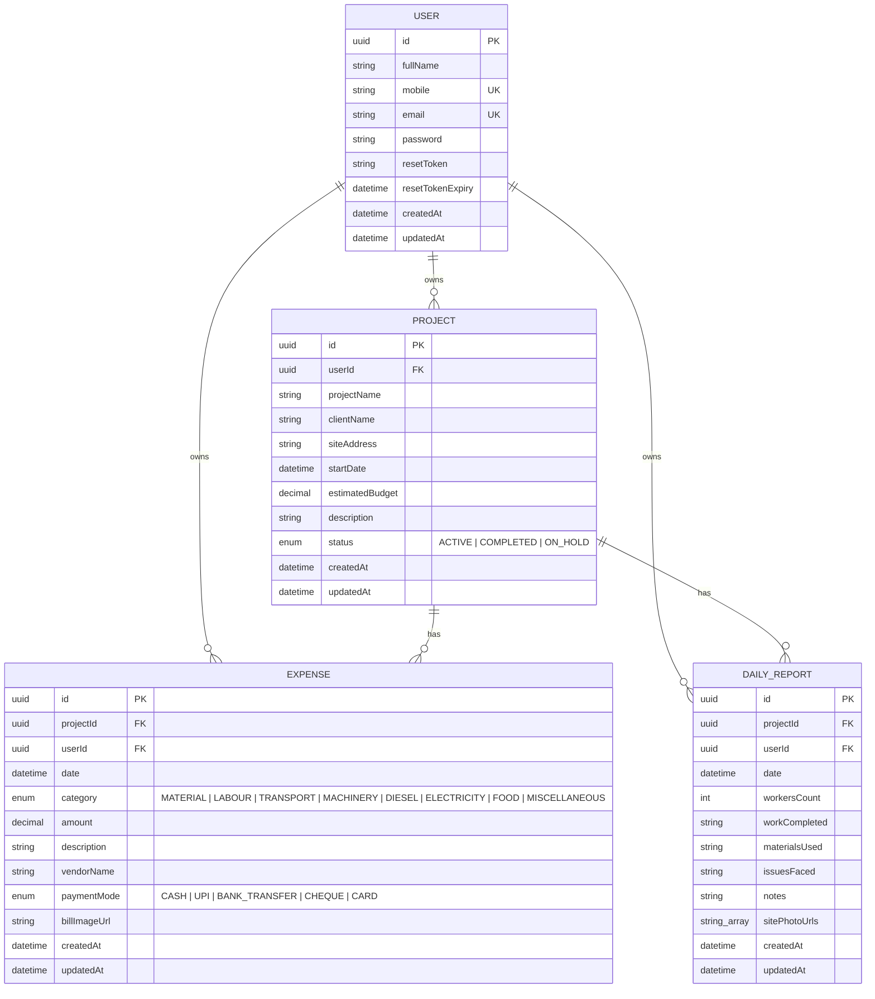

# Entity-Relationship Diagram

The Site Expense Tracker uses a single-tenant (per-user) data model. Every
`Project`, `Expense`, and `DailyReport` belongs to exactly one `User`, and
`Expense`/`DailyReport` also belong to a `Project`. All child records cascade
delete when their parent is deleted.

## Notes
- `User.mobile` and `User.email` are unique — used as login identifiers.
- `Expense` and `DailyReport` both index `userId`, `projectId`, and `date` for
  efficient dashboard aggregation and filtered list queries.
- `Expense` additionally indexes `category` to speed up category filters and
  the dashboard's expense-by-category breakdown.
- `Project.estimatedBudget` and `Expense.amount` are stored as
  `Decimal(14,2)` and serialized as strings/numbers over JSON (handled by
  custom Freezed converters on the Flutter side).
- `DailyReport.sitePhotoUrls` is a Postgres string array of Cloudinary URLs.
- Deleting a `Project` cascades to delete its `Expense` and `DailyReport`
  records; deleting a `User` cascades to all of their data.
