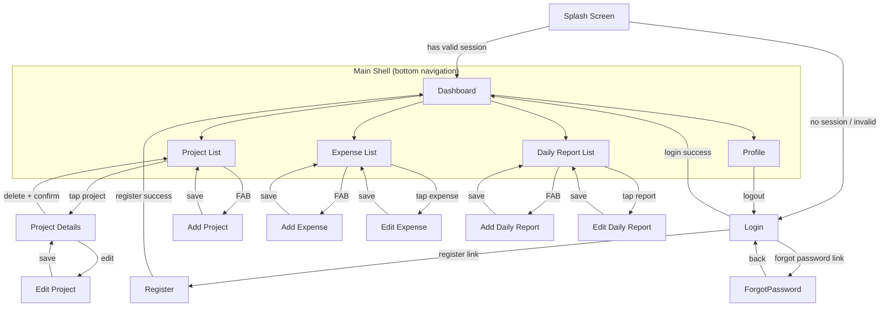

# Screen Flow

## Notes
- The **Main Shell** wraps Dashboard, Projects, Expenses, Reports, and Profile
  behind a `NavigationBar` (bottom tabs). Switching tabs refreshes that tab's
  data.
- **Add/Edit** screens for Project, Expense, and Daily Report are pushed as
  full-screen routes outside the shell (no bottom nav), and pop back to the
  originating list/details screen on save.
- **Edit** routes (`/expenses/:id/edit`, `/reports/:id/edit`,
  `/projects/:id/edit`) fetch the entity by id via its `*DetailsProvider`
  before rendering the form, showing a loading/error state while fetching.
- `GoRouter`'s `redirect` callback enforces:
  - Unauthenticated users are redirected to `/login` from any protected route.
  - Authenticated users are redirected away from `/splash`, `/login`,
    `/register`, and `/forgot-password` to `/dashboard`.
  - A 401 response from the API triggers logout and redirect to `/login`.
